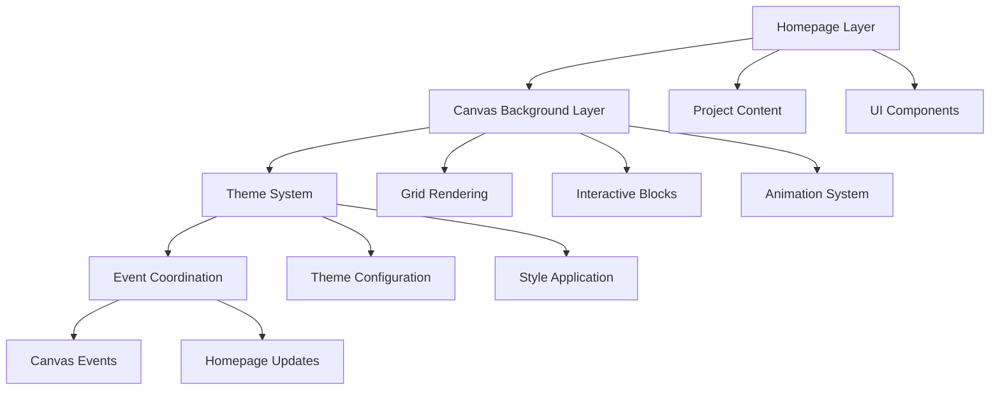

# Design Document: Canvas Theme Integration

## Overview

This design integrates the interactive canvas grid system from `canvas.html` as a background layer for the main `index.html` homepage, implementing a synchronized 4-theme system (light, dark, pink, blue) that creates a cohesive visual experience. The canvas serves as both an engaging background and an interactive theme controller.

## Architecture

The system follows a layered architecture with clear separation of concerns:



### Layer Responsibilities

- **Homepage Layer**: Manages project content, statistics, and main UI components
- **Canvas Background Layer**: Handles grid rendering, user interactions, and block generation
- **Theme System**: Coordinates visual themes across both layers
- **Event Coordination**: Synchronizes theme changes between canvas and homepage

## Components and Interfaces

### 1. Theme Manager

**Purpose**: Central theme coordination system that manages theme state and synchronization.

**Interface**:
```javascript
class ThemeManager {
    constructor(themes, initialTheme)
    getCurrentTheme()
    setTheme(themeKey)
    applyThemeToHomepage(theme)
    applyThemeToCanvas(theme)
    onThemeChange(callback)
}
```

**Responsibilities**:
- Maintain current theme state
- Coordinate theme changes across layers
- Apply theme-specific styles to homepage elements
- Notify canvas of theme changes

### 2. Canvas Background Controller

**Purpose**: Manages the canvas as a background layer with preserved interactivity.

**Interface**:
```javascript
class CanvasBackgroundController {
    constructor(canvasElement, themeManager)
    initialize()
    resize()
    handleInteraction(event)
    generateInteractiveBlocks()
    onBlockClick(callback)
}
```

**Responsibilities**:
- Render canvas as fixed background
- Handle user interactions (drag, zoom, click)
- Generate and manage interactive blocks
- Trigger theme changes on block clicks

### 3. Homepage Theme Adapter

**Purpose**: Applies theme changes to homepage elements and maintains visual consistency.

**Interface**:
```javascript
class HomepageThemeAdapter {
    constructor(themeManager)
    applyTheme(theme)
    updateProjectCards(theme)
    updateHeader(theme)
    updateStats(theme)
}
```

**Responsibilities**:
- Transform homepage styles based on active theme
- Maintain readability and accessibility
- Preserve existing animations and interactions

## Data Models

### Theme Configuration

```javascript
const THEME_CONFIG = {
    light: {
        // Canvas properties
        canvas: {
            bgColor: '#f7f7f7',
            lineColor: '#e0e0e0',
            axisColor: '#bbbbbb',
            highlightColor: '#000000',
            blockColor: '#ffffff',
            highlightOpacity: 0.1
        },
        // Homepage properties
        homepage: {
            bodyBg: 'linear-gradient(135deg, #f8f9fa 0%, #e9ecef 100%)',
            textColor: '#212529',
            cardBg: 'rgba(255, 255, 255, 0.95)',
            cardBorder: 'rgba(0, 0, 0, 0.1)',
            accentColor: '#6c757d',
            shadowColor: 'rgba(0, 0, 0, 0.1)'
        }
    },
    dark: {
        canvas: {
            bgColor: '#0f0f0f',
            lineColor: '#2a2a2a',
            axisColor: '#444444',
            highlightColor: '#ffffff',
            blockColor: '#000000',
            highlightOpacity: 0.15
        },
        homepage: {
            bodyBg: 'linear-gradient(135deg, #1a1a1a 0%, #2d2d2d 100%)',
            textColor: '#f8f9fa',
            cardBg: 'rgba(40, 40, 40, 0.95)',
            cardBorder: 'rgba(255, 255, 255, 0.1)',
            accentColor: '#6c757d',
            shadowColor: 'rgba(0, 0, 0, 0.3)'
        }
    },
    pink: {
        canvas: {
            bgColor: '#fff0f5',
            lineColor: '#ffc0cb',
            axisColor: '#ff69b4',
            highlightColor: '#d6336c',
            blockColor: '#d6336c',
            highlightOpacity: 0.15
        },
        homepage: {
            bodyBg: 'linear-gradient(135deg, #fce4ec 0%, #f8bbd9 100%)',
            textColor: '#880e4f',
            cardBg: 'rgba(255, 240, 245, 0.95)',
            cardBorder: 'rgba(216, 27, 96, 0.2)',
            accentColor: '#ad1457',
            shadowColor: 'rgba(136, 14, 79, 0.2)'
        }
    },
    blue: {
        canvas: {
            bgColor: '#001f3f',
            lineColor: '#0074d9',
            axisColor: '#7fdbff',
            highlightColor: '#39cccc',
            blockColor: '#39cccc',
            highlightOpacity: 0.2
        },
        homepage: {
            bodyBg: 'linear-gradient(135deg, #0d47a1 0%, #1565c0 100%)',
            textColor: '#e3f2fd',
            cardBg: 'rgba(25, 118, 210, 0.15)',
            cardBorder: 'rgba(100, 181, 246, 0.3)',
            accentColor: '#42a5f5',
            shadowColor: 'rgba(13, 71, 161, 0.3)'
        }
    }
};
```

### Interactive Block Model

```javascript
const InteractiveBlock = {
    gridX: Number,           // Grid X coordinate
    gridY: Number,           // Grid Y coordinate
    targetThemeKey: String,  // Theme to activate when clicked
    isClicked: Boolean,      // Animation state
    fadeProgress: Number,    // Animation progress (0-1)
    fadeStartTime: Number    // Animation start timestamp
};
```

## Correctness Properties

*A property is a characteristic or behavior that should hold true across all valid executions of a system-essentially, a formal statement about what the system should do. Properties serve as the bridge between human-readable specifications and machine-verifiable correctness guarantees.*

### Property 1: Canvas Interaction Preservation
*For any* canvas interaction (drag, zoom, hover), all homepage functionality should remain fully operational and responsive
**Validates: Requirements 1.2**

### Property 2: Theme Visual Consistency
*For any* active theme, all homepage UI elements should use colors from that theme's configuration consistently
**Validates: Requirements 2.2**

### Property 3: Canvas-Homepage Theme Synchronization
*For any* theme change, both the canvas background and homepage should update their visual appearance to match the new theme
**Validates: Requirements 2.3, 3.2**

### Property 4: Cross-Theme Readability
*For any* theme, the homepage content should maintain sufficient contrast ratios and visual hierarchy for accessibility
**Validates: Requirements 2.4, 6.3**

### Property 5: Block Click Theme Activation
*For any* interactive block with a target theme, clicking it should change the homepage theme to match the block's target theme
**Validates: Requirements 3.1**

### Property 6: Smooth Theme Transitions
*For any* theme change, the visual transition should complete within 500ms with smooth animation
**Validates: Requirements 3.3, 6.1**

### Property 7: Universal Theme Synchronization
*For any* of the 4 supported themes (light, dark, pink, blue), theme synchronization should work correctly between canvas and homepage
**Validates: Requirements 3.4**

### Property 8: Block Generation Probability
*For any* mouse movement over the canvas, interactive blocks should be generated according to the specified probability distribution
**Validates: Requirements 4.1**

### Property 9: Block Color Assignment
*For any* generated interactive block, it should be assigned one of the 4 valid theme colors (white, black, pink, blue)
**Validates: Requirements 4.2**

### Property 10: Block Click Animation
*For any* interactive block that is clicked, it should trigger a fade-out removal animation
**Validates: Requirements 4.3**

### Property 11: Block Count Limitation
*For any* state of the canvas, the number of interactive blocks should never exceed the maximum limit to maintain performance
**Validates: Requirements 4.4**

### Property 12: Mobile Theme Functionality
*For any* mobile viewport size, theme functionality should work correctly while maintaining readability
**Validates: Requirements 5.1**

### Property 13: Responsive Theme Synchronization
*For any* screen size change, the canvas should adapt while preserving theme synchronization with the homepage
**Validates: Requirements 5.2**

### Property 14: Touch Event Theme Response
*For any* touch interaction on interactive blocks, the theme system should respond correctly to trigger theme changes
**Validates: Requirements 5.3**

### Property 15: Responsive Design Preservation
*For any* screen size, the homepage should maintain all original responsive design features after canvas integration
**Validates: Requirements 5.4**

### Property 16: Performance Maintenance
*For any* canvas rendering operation, the homepage should maintain smooth 60fps performance
**Validates: Requirements 6.2**

### Property 17: Keyboard Navigation Preservation
*For any* keyboard navigation sequence, all homepage functionality should remain accessible with theme functionality intact
**Validates: Requirements 6.4**

<function_calls>
<invoke name="prework">
<parameter name="featureName">canvas-theme-integration

## Error Handling

### Canvas Integration Errors

**Canvas Loading Failures**:
- If canvas fails to initialize, fall back to original homepage background
- Display user-friendly message about reduced functionality
- Ensure homepage remains fully functional

**Theme Application Errors**:
- If theme configuration is invalid, fall back to light theme
- Log errors for debugging while maintaining user experience
- Validate theme configurations on startup

**Performance Degradation**:
- Monitor frame rates and block counts
- Automatically reduce block generation if performance drops
- Provide option to disable canvas background for low-end devices

### User Interaction Errors

**Touch/Mouse Event Conflicts**:
- Prevent canvas interactions from blocking homepage clicks
- Use proper event propagation and z-index management
- Ensure accessibility tools can still navigate the homepage

**Theme Synchronization Failures**:
- If canvas and homepage themes become desynchronized, force re-sync
- Implement fallback mechanisms for theme state recovery
- Provide manual theme selection as backup

## Testing Strategy

### Dual Testing Approach

The testing strategy combines unit tests for specific functionality with property-based tests for comprehensive coverage:

**Unit Tests**:
- Theme configuration validation
- Canvas initialization and setup
- Homepage element theme application
- Interactive block generation and management
- Event handling and propagation
- Error conditions and fallback behaviors

**Property-Based Tests**:
- Universal theme synchronization across all 4 themes
- Canvas interaction preservation across different interaction types
- Performance maintenance under various load conditions
- Accessibility compliance across all theme combinations
- Responsive behavior across different screen sizes

### Testing Framework Configuration

**Property-Based Testing Library**: fast-check (JavaScript)
- Minimum 100 iterations per property test
- Each property test references its design document property
- Tag format: **Feature: canvas-theme-integration, Property {number}: {property_text}**

**Unit Testing Framework**: Jest
- Component-level testing for theme application
- Integration testing for canvas-homepage coordination
- Performance testing for frame rate monitoring
- Accessibility testing for contrast ratios

### Test Environment Setup

**Browser Testing**:
- Cross-browser compatibility (Chrome, Firefox, Safari, Edge)
- Mobile device simulation for touch interactions
- Performance profiling for frame rate monitoring

**Accessibility Testing**:
- WCAG 2.1 AA compliance verification
- Screen reader compatibility testing
- Keyboard navigation testing

**Performance Testing**:
- Frame rate monitoring during canvas operations
- Memory usage tracking for block generation
- Load testing for maximum block scenarios